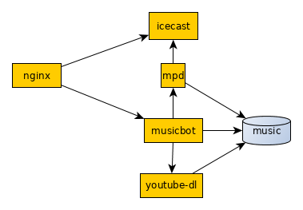

## Overview
Globally, musicbot is part of a set of applications which together
form an internet radio stream. The parts consists of icecast, mpd,
musicbot and youtube-dl. These parts are linked together as followed:



This document assumes that you have installed an
[ArchLinux](https://archlinux.org) system with base + base-devel +
yaourt and have functional networking. If your distribution diverges
from this setup, follow along, but change the values according to your
own distribution.


## Create required directories
For starters, you will need a directory in which you can store the
downloaded mp3's. If needed, create a separate volume for this
directory:
~~~~
mkdir -p /music/2600nl
~~~~

## Installation of icecast
Icecast is a relaying service for mp3 and ogg streams. To run it,
start off by installing the required packages.
~~~~
yaourt -S icecast vorbis-tools
~~~~

Since we are going to run icecast in a chroot environment, we will
need to prepare this directory, as described below:
~~~~
mkdir -p /var/icecast/log
cd /var/icecast
~~~~

Next, move the icecast files into the chroot and link them back
~~~~
mv /usr/share/icecast/* .
ln -s `pwd`/admin /usr/share/icecast/admin
ln -s `pwd`/doc /usr/share/icecast/doc
ln -s `pwd`/web /usr/share/icecast/web
~~~~

Create a log directory and link it into a well known place
~~~~
chown root:icecast log
chmod 0770 log
ln -s `pwd`/log /var/log/icecast
~~~~

Add a user for the daemon and set ownership + permissions
~~~~
useradd -r -d /var/icecast icecast
chown -R root:icecast admin doc web
chmod -R o-rwx admin doc web
~~~~

Next, edit /var/icecast/icecast.xml, and add the following content. Be
sure to adapt it to suit your needs.
```xml
<icecast>
    <location>Enter your location here</location>
    <admin>user@example.com</admin>

    <limits>
        <clients>100</clients>
        <sources>10</sources>
        <queue-size>524288</queue-size>
        <client-timeout>30</client-timeout>
        <header-timeout>15</header-timeout>
        <source-timeout>10</source-timeout>
        <burst-on-connect>1</burst-on-connect>
        <burst-size>65535</burst-size>
    </limits>

    <authentication>
        <source-password>somerandomsourcepassword</source-password>
        <relay-password>anotherrandomrelaypassword</relay-password>
        <admin-user>admin</admin-user>
        <admin-password>supahsekritadminpassword</admin-password>
    </authentication>

    <hostname>radio.yourdomain.com</hostname>

    <listen-socket>
        <port>8000</port>
        <bind-address>0.0.0.0</bind-address>
    </listen-socket>

    <listen-socket>
        <port>8000</port>
        <bind-address>::</bind-address>
    </listen-socket>

    <http-headers>
        <header name="Access-Control-Allow-Origin" value="*" />
    </http-headers>

    <relays-on-demand>1</relays-on-demand>

    <fileserve>0</fileserve>

    <paths>
        <basedir>/var/icecast</basedir>
        <logdir>/log</logdir>
        <webroot>/web</webroot>
        <adminroot>/admin</adminroot>
    </paths>

    <logging>
        <accesslog>access.log</accesslog>
        <errorlog>error.log</errorlog>
        <playlistlog>playlist.log</playlistlog>
        <loglevel>3</loglevel>
        <logsize>10000</logsize>
        <logarchive>1</logarchive>
    </logging>

    <mount>
        <mount-name>/2600.ogg</mount-name>
        <fallback-mount>/silence.ogg</fallback-mount>
        <fallback-override>1</fallback-override>
    </mount>

    <security>
        <chroot>1</chroot>
        <changeowner>
            <user>icecast</user>
            <group>icecast</group>
        </changeowner>
    </security>
</icecast>
```

Add convenience links for the configuration file and set permissions
~~~~
chown root:icecast icecast.xml
chmod o-rwx icecast.xml
rm -f /etc/icecast.xml
ln -s `pwd`/icecast.xml /etc/icecast.xml
~~~~

And finally, enable and start icecast
~~~~
systemctl enable icecast
systemctl restart icecast
~~~~

## Installation of mpd
Start off by installing the packages
~~~~
yaourt -S mpd mpc
~~~~

Since the musicbot is built with multiple streams in mind, the
configuration of mpd is a bit different from the default way of
configuring mpd.

First, remove the default configuration file and create a config
directory:
~~~~
rm -f /etc/mpd.conf
mkdir -p /etc/mpd
~~~~

For each stream, add a configuration file (/etc/mpd/2600nl.conf, for
2600nl radio in this example):
```
music_directory                 "/music/2600nl"
playlist_directory              "/var/spool/mpd/2600nl/playlists"
db_file                         "/var/spool/mpd/2600nl/mpd.db"
log_file                        "/var/log/mpd/2600nl.log"
pid_file                        "/var/spool/mpd/2600nl.pid"
state_file                      "/var/spool/mpd/2600nl/mpdstate"
sticker_file                    "/var/spool/mpd/2600nl/sticker.sql"

user                            "mpd"
group                           "mpd"
bind_to_address                 "any"
port                            "6600"
#log_level                      "default"
#gapless_mp3_playback           "yes"
#restore_paused                 "no"
#save_absolute_paths_in_playlists "no"
#metadata_to_use        "artist,album,title,track,name,genre,date,composer,performer,disc"
auto_update                     "yes"
#auto_update_depth              "3"

#follow_outside_symlinks        "yes"
#follow_inside_symlinks         "yes"

#zeroconf_enabled               "yes"
#zeroconf_name                  "Music Player"

#password                        "password@read,add,control,admin"
#default_permissions             "read"

audio_output {
        type            "shout"
        encoder         "vorbis"
        name            "A tribute to DJShuffle and Sjaak (ogg format)"
        host            "127.0.0.1"
        port            "8000"
        mount           "/2600nl.ogg"
        password        "icecastsourcepassword"
        bitrate         "192"
        format          "44100:16:1"
        protocol        "icecast2"
        user            "source"
        description     "For when you cant wait till DJShuffle comes along"
        url             "https://radio.as65342.net/2600nl"
        genre           "random"
        public          "no"
}

audio_output {
        type            "shout"
        encoding        "mp3"
        encoder         "lame"
        name            "A tribute to DJShuffle and Sjaak (mp3 format)"
        host            "127.0.0.1"
        port            "8000"
        mount           "/2600nl.mp3"
        password        "icecastsourcepassword"
        bitrate         "192"
        format          "44100:16:1"
        protocol        "icecast2"
        user            "source"
        description     "For when you cant wait till DJShuffle comes along"
        url             "https://radio.as65342.net"
        genre           "random"
        public          "no"
}

audio_output {
        type            "null"
        name            "My Null Output"
        mixer_type      "none"                  # optional
}

#replaygain                     "album"
#replaygain_preamp              "0"
#replaygain_missing_preamp      "0"
#replaygain_limit               "yes"
volume_normalization            "yes"

#filesystem_charset             "UTF-8"
```

Create the directories that are required to run mpd:
~~~~
rmdir /var/lib/mpd/playlists
mkdir -p /var/lib/mpd/2600nl/playlists
chown -R mpd:mpd /var/lib/mpd/2600nl
chmod -R o-rwx /var/lib/mpd/2600nl
mkdir -p /var/log/mpd
chown root:mpd /var/log/mpd
chmod 0770 /var/log/mpd
~~~~

Create a unit file for mpd. You will need to do this for each different
stream you want to run:
~~~~
cd /etc/systemd/system
cp /lib/systemd/system/mpd.service mpd-2600nl.service
~~~~

Replace the content of the new unit file with the following:
```
[Unit]
Description=MPD daemon for 2600nl radio
Documentation=man:mpd(1) man:mpd.conf(5)
After=network.target sound.target

[Service]
User=mpd
Type=notify
ExecStart=/usr/bin/mpd --no-daemon /etc/mpd/2600nl.conf

# allow MPD to use real-time priority 50
LimitRTPRIO=50
LimitRTTIME=infinity

# disallow writing to /usr, /bin, /sbin, ...
ProtectSystem=yes

# more paranoid security settings
NoNewPrivileges=yes
ProtectKernelTunables=yes
ProtectControlGroups=yes
ProtectKernelModules=yes
# AF_NETLINK is required by libsmbclient, or it will exit() .. *sigh*
RestrictAddressFamilies=AF_INET AF_INET6 AF_UNIX AF_NETLINK
RestrictNamespaces=yes

[Install]
WantedBy=default.target
Also=mpd.socket
```

Finally, you can enable and start mpd for this stream
~~~~
systemctl enable mpd-2600nl
systemctl start mpd-2600nl
~~~~

# Installation of musicbot
Start off by installing go and its dependencies, and configuring a
directory in which to store the Go code:
~~~~
yaourt -S go git
mkdir /usr/go
export GOPATH=/usr/go
~~~~

Next, fetch, build and install musicbot
~~~~
yaourt -S youtube-dl
go get -v github.com/r3boot/go-musicbot
cd ${GOPATH}/src/github.com/r3boot/go-musicbot
go get -v ./...
make deps
make musicbot
make id3tag
make install
~~~~

Like mpd, you will need to configure one instance of musicbot per
radio stream. To do this, follow the steps below.

First off, create a user for the bot, and make sure that the user is
able to write in the music directory:
~~~~
useradd -r -d /var/lib/mpd/2600nl musicbot
chown -R musicbot: /music
~~~~

Next, create a config directory for musicbot:
~~~~
mkdir /etc/musicbot
~~~~

Add a configuration file like the one below for each different stream:
```yaml
---
application:
  ircbot: true
  api: true
  webui: true
  daemonize: false
  debug: false

irc:
  nickname: "RadioBot"
  server: "irc.smurfnet.ch"
  port: 6697
  channel: "#2600nl"
  tls: true

bot:
  command_character: "!"
  valid_commands:
    - "dj+"
    - "djlist"
    - "start"
    - "next"
    - "np"
    - "radio"
    - "boo"
    - "tune"
    - "request"
    - "queue"
    - "help"
  stream_url: "http://radio.as65342.net:8000/2600nl.ogg.m3u"
  radio_messages:
    - "Tired of waiting for DJShuffle?"
    - "Fed up with the youtube links of berm?"
    - "Cant wait till friday?"
    - "Gaat de meet nog door?"
    - "Feeling lonely?"
    - "Are you missing DJShuffle?"
    - "Did you miss Sjaak?"


youtube:
  music_basedir: "/music"
  downloader: "/usr/bin/youtube-dl"
  seen_file: "/var/spool/musicbot-2600nl.seen"
  url: "https://www.youtube.com/watch?v="

mpd:
  address: "127.0.0.1"
  port: 6600
  password: ""

api:
  address: "0.0.0.0"
  port: 8666
  title: "2600nl radio"
  stream_url: "https://radio.as65342.net/stream/2600nl.ogg"
  assets: /usr/local/share/musicbot
```

Finish off by enabling and starting musicbot.
~~~~
systemctl enable musicbot-2600nl
systemctl start musicbot-2600nl
~~~~

# Installation of nginx
In order to offer service to a wide array of people in a wide array of
networks, nginx is used to tunnel all radio related traffic over tcp
port 443 (TLS), apart from the default unencrypted port of 8000. To
do this, you will need nginx. Note, configuration of TLS certificates
is not explained in this example.

Start off by installing the package:
~~~~
yaourt -S nginx
~~~~

Stock nginx under archlinux is unconfigured, and will need some work.
Start off by creating a dedicated user for nginx:
~~~~
useradd -r -d /var/empty www
~~~~

Next, create additional directories:
~~~~
cd /etc/nginx
mkdir conf.d sites
~~~~

You will need to create a /etc/nginx/proxy_params file with the
following content:
```
proxy_set_header Host $http_host;
proxy_set_header X-Real-IP $remote_addr;
proxy_set_header X-Forwarded-For $proxy_add_x_forwarded_for;
proxy_set_header X-Forwarded-Proto $scheme;
```

Nginx.conf needs to be updated to reflect the new directory layouts.
Edit /etc/nginx/nginx.conf and update it to match the configuration
below:
```
user www;
worker_processes  2;
error_log  /var/log/nginx/error.log;

events {
    worker_connections  1024;
}


http {
    include       mime.types;
    default_type  application/octet-stream;

    log_format  main  '$remote_addr - $remote_user [$time_local] "$request" '
                      '$status $body_bytes_sent "$http_referer" '
                      '"$http_user_agent" "$http_x_forwarded_for"';

    access_log  /var/log/nginx/access.log  main;

    sendfile        on;
    #tcp_nopush     on;

    #keepalive_timeout  0;
    keepalive_timeout  65;

    #gzip  on;

    include /etc/nginx/sites/*.conf;
}
```

Next, create a virtual host configuration for the radio stream. Edit
/etc/nginx/sites/default.conf and add the following:
```
upstream radio_api {
    server [::1]:8666;
}

upstream radio_stream {
        server [::1]:8000;
}

server {
    listen          80;
    listen          [::]:80;
    server_name     _;

    root            /usr/local/share/musicbot;
    access_log      /var/log/nginx/2600nl/access.log main;
    error_log       /var/log/nginx/2600nl/error.log;

    include         /etc/nginx/conf.d/letsencrypt.conf;

    return          301 https://$http_host$request_uri;
}

server {
    listen          443 ssl;
    listen          [::]:443 ssl;
    server_name     _;

    root            /usr/local/share/musicbot;
    access_log      /var/log/nginx/2600nl/access.log main;
    error_log       /var/log/nginx/2600nl/error.log;
    ssl                         on;
    ssl_certificate     /etc/letsencrypt/certs/radio.as65342.net/fullchain.pem;
    ssl_certificate_key /etc/letsencrypt/certs/radio.as65342.net/privkey.pem;
    include             /etc/nginx/conf.d/tls.conf;

    include /etc/nginx/conf.d/letsencrypt.conf;

    location /2600nl {
        include /etc/nginx/proxy_params;
        proxy_pass http://radio_api;
    }

    location /playlist {
        include /etc/nginx/proxy_params;
        proxy_pass http://radio_api;
    }

    location /ta {
        include /etc/nginx/proxy_params;
        proxy_pass http://radio_api;
    }

    location /ws {
        include /etc/nginx/proxy_params;
        proxy_http_version 1.1;
        proxy_set_header Upgrade $http_upgrade;
        proxy_set_header Connection "upgrade";
        proxy_pass http://radio_api;
    }

    location ~ /stream/([a-zA-Z0-9_-]+.ogg) {
        include /etc/nginx/proxy_params;
        proxy_pass http://radio_stream/$1;
    }
}
```

Dont forget to create a log directory for this vhost:
~~~~
mkdir -p /var/log/nginx/2600nl
~~~~

Finally, enable and start nginx
~~~~
systemctl enable nginx
systemctl start nginx
~~~~

## Using the radio stream
Once you've completed all steps in this document, your stream should be
available. Try navigating to one of the URL's below:

[Icecast stream output](http://localhost:8000/2600nl.ogg.m3u)

[MPD control](http://localhost:6600)

[Web UI](http://localhost:8666)

[TLS Icecast stream output](https://localhost/stream/2600nl.ogg)

[TLS Web UI](https://localhost/2600nl)

