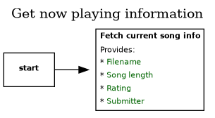

# User controllable options
The following functionality is available to users:
* Add a new track
* Request a track
* Skip to the next song
* Submit a positive rating for the current track
* Submit a negative rating for the current track
* Show the currently playing song

The following functionality is restricted to the program:
* Synchronize

# Add a new track

# Request a track

# Skip to the next song
 "Skip to the next track")

# Submit a positive rating for the current track

# Submit a negative rating for the current track

# Show the currently playing song

# Synchronize
